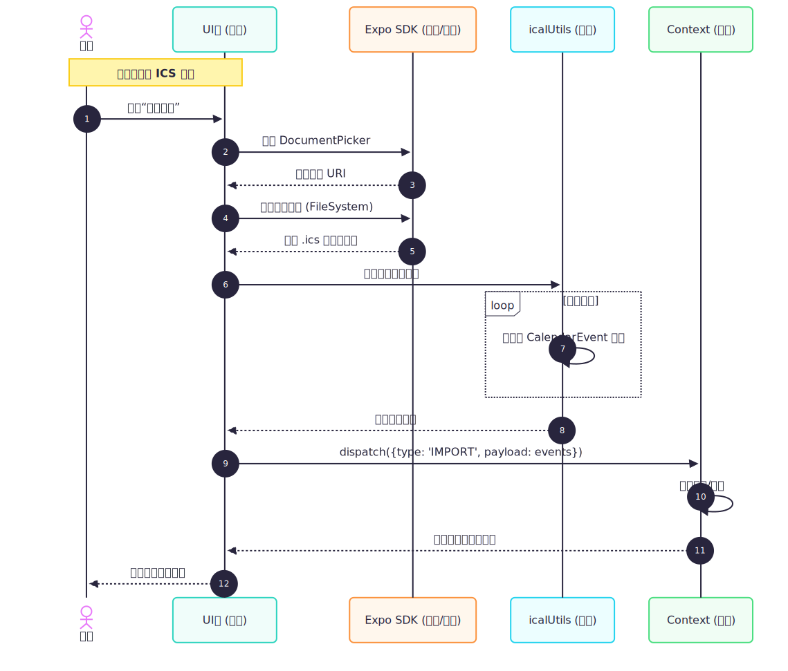

# MyCalendarApp 产品报告

## ① 产品功能介绍

- 定位：一款轻量的跨平台日历应用（React Native + TypeScript + Expo），用于查看日历、管理纪念日、导入/导出 ICS 并支持本地提醒。
- 视图：支持月 / 周 / 日三种日历视图，可切换查看不同粒度的日程。
- 纪念日管理：长按或新增可创建纪念日；支持多条纪念日/日，字段包括摘要、描述、开始/结束时间、全天标识、类型（anniversary/event）。
- ICS 导入/导出：基于 `ical.js` 解析与生成 `.ics` 文件，保持类型标签（如 `CATEGORIES:ANNIVERSARY`、`X-MINICAL-TYPE`）以保证回传信息。
- 本地提醒：可选的本地通知（`expo-notifications`），支持提前 N 分钟提醒并在事件更新/删除时同步取消或更新提醒。
- 事件列表：第二 Tab 按有事件的日期分组展示所有事件。
- 存储与扩展：当前以内存 Context 存储为主，设计可替换为 `AsyncStorage` / `SQLite` 或云同步方案。

## ② 程序概要设计

- 模块划分：
  - UI 层：`app/`（路由与页面）、`components/`（日历组件、屏幕与 UI 原语）。
  - 状态层：`context/calendar-events-context.tsx`（统一事件 API）。
  - 工具层：`utils/`（`calendarUtils.ts`、`icalUtils.ts`、`notifications.ts`、`colorUtils.ts`）。
  - 平台服务：Expo API（`expo-document-picker`、`expo-file-system`、`expo-sharing`、`expo-notifications`）。
- 数据模型（摘自 `utils/icalUtils.ts`）：
  - `CalendarEvent`：`id: string`、`summary: string`、`start: Date`、`end?: Date`、`description?: string`、`type?: 'event'|'anniversary'`、`allDay?: boolean`、`reminderEnabled?: boolean`、`reminderMinutesBefore?: number`、`notificationId?: string`。
- 核心交互流程：
  1. 应用启动：`SafeAreaProvider` + Context Provider -> 渲染日历首页。
  2. 增删改事件：在日历页触发 modal（`modal.tsx`）-> 调用 Context API -> 若启用提醒则调用 `notifications.ts` 来安排或取消通知 -> 更新 UI。
  3. 导入：`expo-document-picker` 选择 ICS -> `expo-file-system` 读取 -> `icalUtils.ts` 用 `ical.js` 解析 -> 映射为 `CalendarEvent` 并合并/去重。
  4. 导出：收集事件 -> `icalUtils.ts` 生成 `.ics` 文本 -> 写入临时文件 -> 用 `expo-sharing` 分享或保存。
- 设计原则：纯工具（无副作用）与副作用隔离、模块化组件、最小依赖与可替换持久化。

## ③ 软件架构图

下图展示了系统的逻辑层次与数据流：

文字说明：
- UI 层：`app/` 路由与页面、`components/` 中的日历/屏幕组件负责交互和渲染。
- 状态層：`context/calendar-events-context.tsx` 负责事件的增删改查与在内存中的管理，暴露给 UI 使用。
- 工具层：`utils/` 提供纯函数（日期计算、ICS 转换、通知封装），副作用（文件 I/O、通知权限）由页面/服务发起。
- 平台服务：Expo 的 Document Picker、File System、Sharing 与 Notifications 提供底层能力。

数据流示例：UI -> Context（写入）-> Context 更新 -> UI 重新渲染；导入流程：UI -> 文件选择 -> `icalUtils` 解析 -> Context 写入。

对于日历的导入导出，详细流程见时序图：

## ④ 技术亮点及其实现原理（可选）

- ICS 双向兼容处理：
  - 亮点：准确支持全日（DATE）与定时（DATE-TIME）事件，保留自定义标签以使导入/导出可回传类型信息。
  - 实现要点：基于 `ical.js` 解析 VEVENT，将 `DTSTART`/`DTEND` 映射为 `Date` 或全天事件（注意 RFC 的 `DTEND` 表示区间上界，对全日事件需减 1 日或使用 DATE 类型）。导出时根据 `allDay` 选择 DATE/DATE-TIME 格式并写入 `CATEGORIES`/`X-MINICAL-TYPE`。
- 本地提醒的可维护封装：
  - 亮点：将通知调度封装在 `notifications.ts`，并在事件模型中记录 `notificationId`，方便更新与取消。
  - 实现要点：使用 `expo-notifications` 的 `scheduleNotificationAsync` 与 `cancelScheduledNotificationAsync`；在事件更新时先取消旧通知再重新安排。
- 纯工具与侧效果分离提高可测试性：
  - 亮点：`utils/` 的函数可独立单元测试，不依赖 I/O。
  - 实现要点：所有文件读写、分享与权限请求集中在页面/服务层，工具只做转换与计算。

